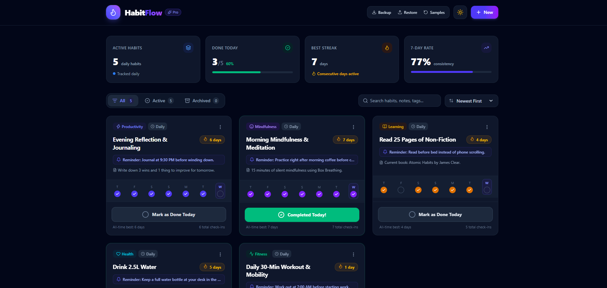
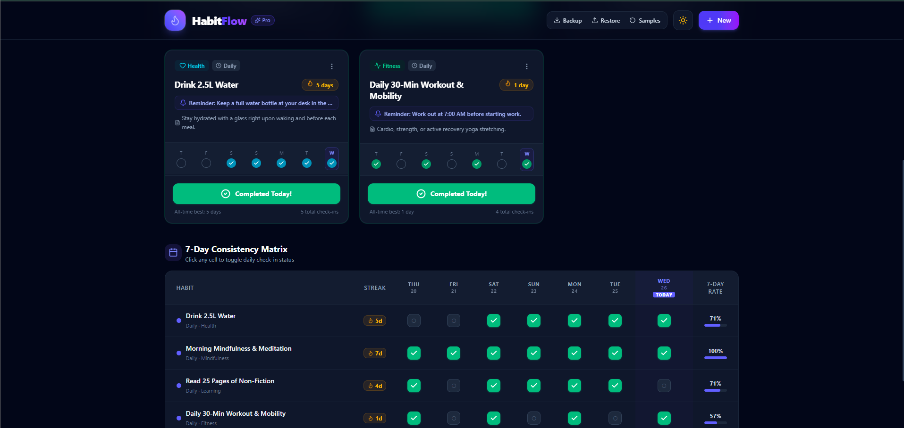
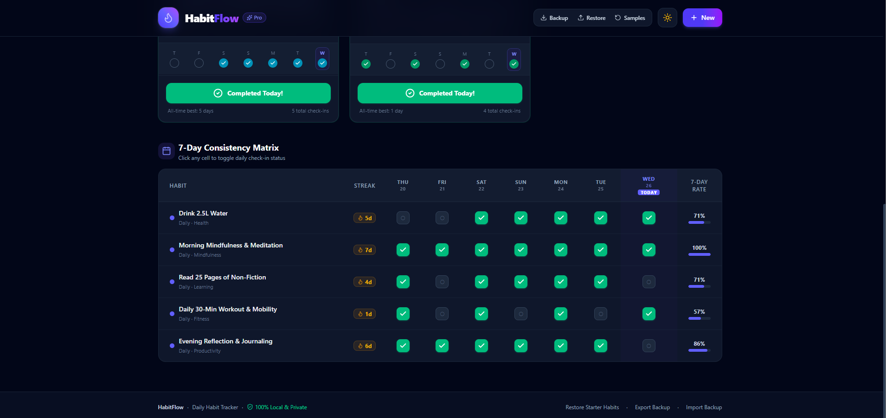
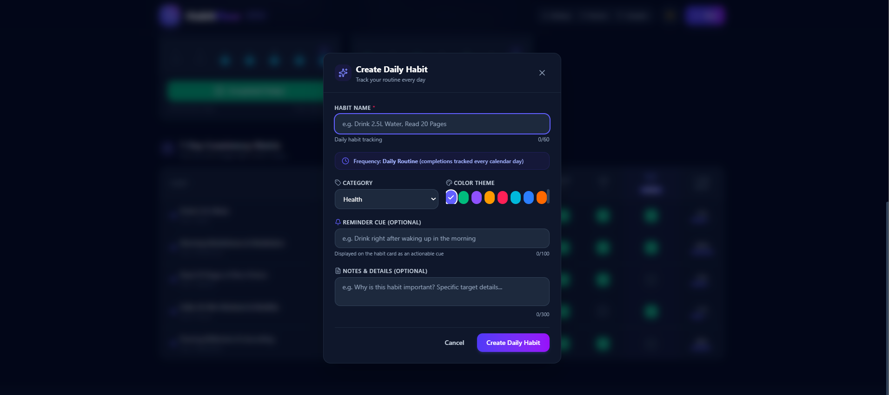

# 🚀 HabitFlow — Production-Ready Daily Habit Tracker

<div align="center">



**A modern, responsive, local-first daily habit tracking application built with React and TypeScript.**

[Features](#-features--capabilities) •
[Tech Stack](#-tech-stack) •
[Quick Start](#-quick-start) •
[Testing](#-testing) •
[Screenshots](#-screenshots)

</div>

---

## 📸 Screenshots

### 🏠 Dashboard Overview


The dashboard provides a complete overview of:

- Active habits
- Habits completed today
- Best streak
- 7-day consistency rate
- Search and sorting
- Daily habit cards

---

### 📊 Habit Cards and Progress



Each habit card displays:

- Habit category
- Daily tracking status
- Current streak
- Reminder cue
- Notes and details
- Last 7 days of activity
- Total check-ins
- One-click completion button

---

### 📅 7-Day Consistency Matrix



The interactive consistency matrix allows users to:

- View all active habits
- Track the previous 7 calendar days
- Identify today's date
- Toggle past or current check-ins
- View individual streaks
- View 7-day completion rates

---

### ➕ Create a New Habit



Users can create customized habits with:

- Habit name
- Category
- Color theme
- Reminder cue
- Notes and details

---

# ✨ Features & Capabilities

## 1. 📋 Daily Habit Management

HabitFlow provides a complete system for managing daily routines.

### Features

- **100% Daily Habits**
- Create unlimited habits
- Edit existing habits
- Archive and restore habits
- Permanently delete habits
- Reset habit progress
- Add custom categories
- Add reminder cues
- Add notes and motivation
- Assign custom color themes

### Available Categories

- Health
- Fitness
- Mindfulness
- Learning
- Productivity
- Other

### Available Color Themes

- Indigo
- Emerald
- Violet
- Amber
- Rose
- Cyan
- Blue
- Orange

---

# 🔥 Intelligent Daily Streak Engine

HabitFlow includes a deterministic streak calculation engine.

### Features

- Tracks consecutive calendar days
- Calculates current streak
- Calculates all-time longest streak
- Supports yesterday grace rule
- Handles duplicate check-ins
- Handles broken streaks
- Handles month boundaries
- Handles year boundaries
- Handles leap years

### Yesterday Grace Rule

If a user completed a habit yesterday but has not completed it today yet, the streak remains active.

Example:

```text
Monday   ✅
Tuesday  ✅
Wednesday ❌ (Today)

Current Streak = 2
# HabitFlow — Production-Ready Daily Habit Tracker

A responsive, polished, local-first **Daily Habit Tracker** web application built with **React 19**, **TypeScript**, **Vite**, **Tailwind CSS**, **Lucide Icons**, and **Vitest**.

HabitFlow empowers users to build lasting daily routines, track check-ins across calendar days, compute streaks across calendar boundaries, visualize consistency in a dynamic 7-day matrix, and persist data locally in the browser with zero backend dependencies.

---

## 🚀 Quick Start

### Prerequisites
- Node.js (v18.0.0 or later)
- npm (v9.0.0 or later)

### Installation & Local Development Server

```bash
# Clone or navigate to the repository
cd habit-tracker

# Install all dependencies
npm install

# Start the Vite development server
npm run dev
```

The application is served locally at `http://localhost:5173/`.

### Running Automated Test Suite

```bash
# Run Vitest test suite (43 comprehensive unit & integration tests)
npm test

# Run tests in interactive watch mode
npm run test:watch
```

### Production Build & Typecheck

```bash
npm run build
```

---

## ✨ Features & Capabilities

### 1. Daily Habit Management
- **100% Daily Habits**: Every routine in HabitFlow is tracked on a daily cadence.
- **Customization**: Assign distinct color themes (`Indigo`, `Emerald`, `Violet`, `Amber`, `Rose`, `Cyan`, `Blue`, `Orange`) and categorized tags (`Health`, `Fitness`, `Mindfulness`, `Learning`, `Productivity`, `Other`).
- **Actionable Reminder Cues**: Add optional reminder cue text shown on habit cards (e.g., *"Drink in the morning right after waking up"*).
- **Notes & Motivation**: Add expandable notes to record micro-goals and routine details.
- **Edit Habits**: Modify names, categories, colors, notes, and reminders at any time without losing historical completion check-ins.
- **Archive & Restore**: Move routines to the `Archived` tab to declutter your active dashboard while preserving completion records. Restore them to active status anytime.
- **Safe Reset Progress**: Reset check-ins and streaks with a confirmation dialog while keeping the habit configuration intact.
- **Permanent Deletion**: Permanently delete unwanted habits with safety confirmation.

### 2. Intelligent Daily Streak Engine
- **Consecutive Calendar Days**: Streaks count consecutive calendar days on which a habit was completed.
- **Yesterday-Grace Rule**: If you completed yesterday but haven't checked in today yet, your streak remains **active** (pending today's check-in).
- **Boundary Handling**: Accurately handles month roll-overs (e.g., Feb 28 to Mar 1), leap years (Feb 29), and year boundaries (Dec 31 to Jan 1).
- **Dual Streak Metrics**: Tracks both **Current Streak** and all-time **Longest Streak**.

### 3. Dynamic 7-Day Consistency Matrix
- Interactive matrix table displaying all active daily habits alongside the most recent 7 calendar days ending today.
- **Visible `TODAY` Indicator**: Clearly highlights today's column.
- **One-Click Retroactive Check-Ins**: Click any cell in the 7-day grid to toggle check-in status (`Mark complete` / `Undo completion`) for past days or today.
- Visual completion rate bar per habit over the 7-day period.

### 4. Real-time Dashboard Analytics
- **Active Habits**: Total count of active daily routines.
- **Done Today**: Mathematically calculated as:
  $$\text{Done Today} = \frac{\text{Active habits completed today}}{\text{Total active habits}}$$
- **Best Streak**: Maximum current daily streak across all active habits.
- **7-Day Rate**: Aggregate consistency calculated as:
  $$\text{7-Day Rate} = \frac{\text{Total completed daily check-ins in past 7 days}}{\text{Total active habits} \times 7} \times 100\%$$
- **Archived Exclusion**: Archived habits are strictly excluded from active statistics.

### 5. Local-First & Resilient Persistence
- Instant synchronization to browser `localStorage` under `HABIT_TRACKER_DATA_V1`.
- **Schema Validation & Migration**: Corrupted or malformed storage payloads are sanitized and recovered automatically without crashing the UI.
- **Backup & Restore**: Export all habit data to a JSON backup file matching schema:
  ```json
  {
    "version": 1,
    "exportedAt": "2026-08-26T16:00:00.000Z",
    "habits": [...]
  }
  ```
- **Starter Daily Habits**: Includes realistic onboarding habits on first launch with confirmation protection before resetting to defaults.

### 6. UI & UX Polish
- Dark / Light mode toggle with automatic system preference detection and localStorage persistence.
- Celebration confetti particle animations on completing habits and reaching 7-day streak milestones (`canvas-confetti`).
- Accessible modal dialogs with keyboard support (<kbd>Escape</kbd> to dismiss, <kbd>Enter</kbd> to submit).
- Contextual empty states for no habits, no active habits, all habits archived, and no search results.

---

## 🏗️ Architecture & Project Structure

```
habit-tracker/
├── src/
│   ├── types/
│   │   └── habit.ts            # TypeScript interfaces, types, and schema contracts
│   ├── utils/
│   │   ├── date.ts             # Deterministic date formatting & calendar calculations
│   │   ├── streak.ts           # Pure daily streak calculation algorithm
│   │   ├── storage.ts          # Resilient localStorage engine & JSON backup validator
│   │   └── sampleData.ts       # Starter daily habits with realistic streak records
│   ├── hooks/
│   │   └── useHabits.ts        # Centralized custom hook for daily state & operations
│   ├── components/
│   │   ├── Header.tsx          # Brand, theme toggle, backup/restore, Add Habit CTA
│   │   ├── HabitStats.tsx       # 4 metric cards (Active, Today, Streak, 7-Day Rate)
│   │   ├── HabitFilters.tsx     # Filter tabs (All / Active / Archived), Search, Sort
│   │   ├── HabitCard.tsx        # Card with 1-tap check-in, mini 7-day track, action menu
│   │   ├── WeeklyView.tsx       # 7-Day interactive consistency matrix
│   │   ├── HabitFormModal.tsx   # Modal for creating & editing daily habits
│   │   ├── ConfirmModal.tsx     # Safety confirmation dialog for reset/archive/delete/restore
│   │   ├── ResetConfirmModal.tsx# Wrapper for backward compatibility
│   │   ├── EmptyState.tsx       # Contextual empty state views
│   │   ├── Toast.tsx            # Floating feedback notifications
│   │   └── Confetti.tsx         # Confetti celebration micro-interactions
│   ├── App.tsx                 # Root application composition & layout
│   ├── main.tsx                # React DOM root entrypoint
│   └── index.css               # Tailwind CSS imports & theme styles
├── tests/
│   ├── setup.ts                # Vitest jsdom setup, polyfills, and canvas mock
│   ├── streak.test.ts          # 14 unit tests for daily streak logic & calendar boundaries
│   ├── habit.test.ts           # 11 unit tests for date utils & habit CRUD lifecycle
│   ├── stats.test.ts           # 5 unit tests verifying mathematical stats correctness
│   ├── storage.test.ts         # 7 unit tests for persistence, validation & recovery
│   └── app.test.tsx            # 6 integration tests with React Testing Library
├── README.md                   # Project documentation
├── prompt.md                   # AI development prompt log
├── package.json
├── tsconfig.json
└── vite.config.ts
```

---

## 📐 Key Design Decisions

### 1. Pure Deterministic Daily Streak Engine (`src/utils/streak.ts`)
- Business logic is strictly decoupled from React components.
- Streak functions take an array of `YYYY-MM-DD` strings and an optional reference date (`refDateStr`), making tests deterministic without system time dependency.
- Correctly handles leap years and timezone shifts.

### 2. Daily Cadence Focus
- All habits follow a daily schedule. This eliminates ambiguity in streak calculations and ensures a focused, high-retention habit tracking experience.

### 3. Graceful Storage Fallback & Schema Migration (`src/utils/storage.ts`)
- Incoming storage payloads pass through `isValidHabit` and `sanitizeHabitRecord`.
- Corrupted JSON or invalid objects are filtered out safely without crashing the React runtime.

### 4. Separation of Concerns in State (`src/hooks/useHabits.ts`)
- Application state (filtering, sorting, searching, toast notifications, habits persistence, stats calculation) is encapsulated in `useHabits`.

---

## 🧪 Testing Summary

HabitFlow includes **43 automated tests** across 5 test suites with Vitest:

| Test Suite | Tests | Description |
| :--- | :---: | :--- |
| `tests/streak.test.ts` | 14 | Daily streak calculations, grace period, broken streaks, duplicate dates, leap years, month & year boundaries |
| `tests/habit.test.ts` | 11 | Date calculations, toggle operations, duplicate prevention, archiving, progress reset |
| `tests/stats.test.ts` | 5 | Mathematical verification of Done Today, Best Streak, 7-Day Rate, and archived exclusion |
| `tests/storage.test.ts` | 7 | LocalStorage persistence, schema validation, corrupted JSON recovery, export/import |
| `tests/app.test.tsx` | 6 | React Testing Library integration tests for rendering, modals, input validation, search/filters, matrix toggling, and confirmation dialogs |

---


